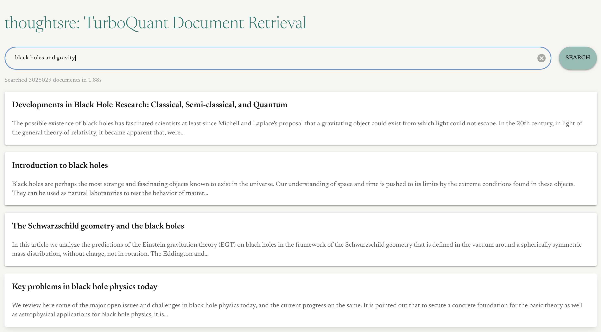

# TurboQuant Document Retrieval

[TurboQuant](https://research.google/blog/turboquant-redefining-ai-efficiency-with-extreme-compression/) is an algorithm devised by Google that enables extreme compression of embeddings with little/no loss of information in a data-obliviious way. 

The two main implications are:

1. Key-value stores can be much smaller
2. Applications like RAG can now be performed without periodic retraining to find embedding clusters that are used in document retrieval

In this repo, I build TurboQuant from scratch.

## Prerequisites
- `uv` for environment management and running scripts

## Quickstart

The resources here assume each embedding coordinate is embedded using 4-bits and the QJL correction is implemented as an additional bit. In the notation of the paper, $b=5$.

To try other bit lengths, see [next section](#creating-the-embeddings-from-scratch).

1. Run [`lib/download_all_resources.py`](./lib/download_all_resources.py) to download all required resources

```shell
uv run python -m lib.download_all_resources
```

2. Run the demo

```shell
uv run python demo.py
```

## Creating the embeddings from scratch
1. Download the raw data: `uv run python -m lib.download_arxiv`

2. Create the embeddings using Sentence Transformers: `uv run python -m lib.create_embeddings`
    - This will take quite a while if you don't have a dedicated GPU
    - Took 5+ hours on my M4 MacBook Air

3. Create the TurboQuant embeddings: `uv run python -m lib.create_quantized_embeddings --with_qjl`
    - Check the [script arguments](./lib/create_quantized_embeddings.py) to understand how to generate embeddings using different bit lengths
    - Note that the codebook only has centroid coordinates up to 5 bits. Anything more, you will also have to [re-generate the codebook](./lib/create_codebook.py)



## Performance Notes
- Both the embeddings and documentsa are loaded into memory in the demo. It might take ~8GB of RAM.
- If you don't have enough RAM, consider [converting the documents dataframe to a lazy Polars dataframe](https://github.com/thoughtsre/turboquant-rag/blob/main/lib/turboquant/turboquant.py#L203)
